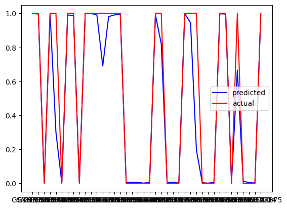
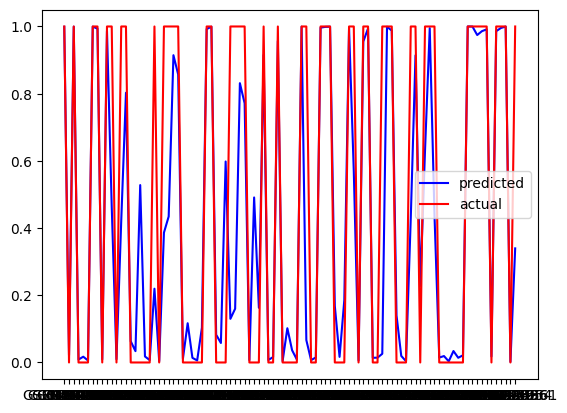
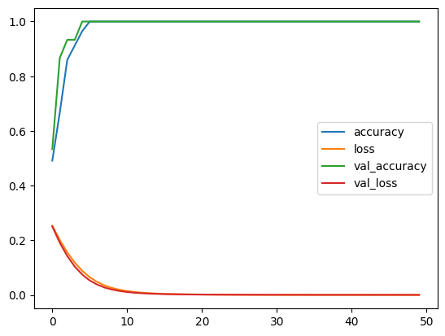

# NSCLC Analysis

This repository contains a Jupyter Notebook for the analysis of Non-Small Cell Lung Cancer (NSCLC) data using various machine learning techniques.

## Table of Contents
- [Introduction](#introduction)
- [Project Description](#project-description)
- [Methodology](#methodology)
- [Data](#data)
- [Installation](#installation)
- [Usage](#usage)
- [Results](#results)
- [Conclusion](#conclusion)
- [Future Work](#future-work)
- [Project Structure](#project-structure)
- [Contributing](#contributing)
- [License](#license)

## Introduction
Non-Small Cell Lung Cancer (NSCLC) is one of the most common types of lung cancer, accounting for about 85% of all lung cancer cases. Early detection and treatment are crucial for improving patient outcomes. This project aims to leverage machine learning to identify significant features and predict outcomes for NSCLC patients.

## Project Description
The goal of this project is to perform a detailed analysis of NSCLC data, including data preprocessing, feature selection, model training, and evaluation. The notebook includes various machine learning models to predict patient outcomes and identify the most important features contributing to these outcomes.

## Methodology
The analysis follows these main steps:
1. **Data Preprocessing**: Cleaning and preparing the data for analysis.
2. **Feature Selection**: Identifying the most relevant features using techniques like SelectFromModel.
3. **Model Training**: Training various machine learning models such as logistic regression, decision trees, and random forests.
4. **Model Evaluation**: Evaluating the performance of the models using metrics like accuracy, precision, recall, and F1-score.
5. **Visualization**: Visualizing the results and important features using libraries like Seaborn.

## Data
The dataset used in this project includes clinical information of NSCLC patients. It contains 54000 gene expresssion levels, tumor characteristics, and treatment outcomes. The data is preprocessed to handle missing values and standardize the format for analysis.

## Installation
To run the notebook, you need to have Python 3 installed along with the required libraries. You can install the dependencies using pip:

```bash
pip install numpy pandas scikit-learn seaborn
```

## Usage
1. **Clone the respository:**
   ```bash
   git clone https://github.com/yourusername/your-repo-name.git
2. **Navigate to the repository directory:**
   ```bash
   cd your-repo-name
3. **Open the Jupyter Notebook:**
   ```bash
   jupyter notebook NSCLC.ipynb

## Result
The result of the notebook includes:
  * Model performance metrics for each machine learning model.
  * Feature importance scores highlighting the most significant features for predicting NSCLC outcomes.
  * Visualizations such as correlation heatmaps, feature distributions, and ROC curves.
  * Model predictions on new test data:
    -  **Dataset:** GSE27262
        + 
    - **Dataset:** GSE19804
        + 
  * Performance of the model:
   - 
   
## Conclusion
This project demonstrates the application of machine learning to NSCLC data, providing insights into significant features and predictive modeling. The models developed can assist in early diagnosis and personalized treatment planning for NSCLC patients.

## Future Work
Future improvements to this project could include:
* Incorporating additional datasets to improve model generalizability.
* Exploring more advanced machine learning techniques such as ensemble methods and deep learning.
* Implementing hyperparameter tuning for model optimization.
* Developing a user-friendly application for clinicians to use the predictive models.

## Project structure
```kotlin
Lasso-ElasticNet-regression-in-Lung-Cancer/
├── NSCLC.ipynb
├── README.md
├── graphs
   └── All plots on tests and model
├── models
   └── keras models on which was trained and tested
└── data/
    └── GEO datasets
```

## Contributing
Contributions are welcome! Please open an issue or submit a pull request for any improvements or suggestions.

## License
This project is licensed under the MIT License.
```css

To use this, create a file named `README.md` in your repository and paste the content above into the file. Customize any section as needed to better fit your project specifics.
```
